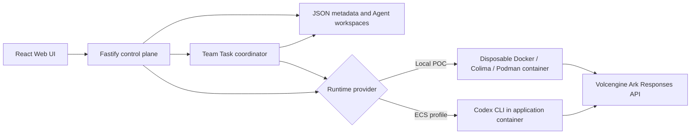

# Volc Agent Launchpad

A working multi-Agent coordination platform for middleware hackathons. It provides
Agent CRUD, a browser Playground, persistent workspaces, and a deterministic Team
Task coordinator backed by Codex CLI and the Volcengine Ark Responses API.

Run it locally with Docker, Colima, or rootless Podman, or deploy it to
Volcengine ECS.

> [!WARNING]
> This is a single-user hackathon application, not a multi-tenant production
> service. It includes coordination audit events and disposable Runtime
> containers, but it does not provide end-user identity or production hardening.
> Do not use production data or credentials. See [SECURITY.md](SECURITY.md).

## Track 1 submission: Bouncer

PotatoGuard separates the human operating the platform from the Agent acting
for that human. A protected file is mounted into the disposable Agent Runtime
only when a scoped, unexpired, unrevoked capability permits the read. Denied
files never enter the Runtime.

The submission includes:

- [One-page architecture and trust-boundary diagram](docs/POTATOGUARD_ARCHITECTURE.md)
- [Three-minute live demo script](docs/DEMO.md)
- [Exact happy-path and edge-case judge runbook](docs/JUDGE_RUNBOOK.md)
- Automated authentication, ownership, authorization, revocation, and Runtime
  mount tests

## Features

- Username/password login with scrypt password hashes and HttpOnly sessions
- Per-user Agent ownership and a separate principal for every Agent
- Time-limited capability leases scoped to one Agent, action, and resource
- Protected-resource create, metadata/content replacement, and safe deletion
- Backend policy enforcement before Agent execution
- Read-only protected-file mounts in disposable local Runtime containers
- Immediate revocation, automatic expiry, and deny-by-default behavior
- Hash-chained allow/deny receipts with human and Agent attribution and CSV export
- Browser-supplied human/owner IDs rejected at the HTTP boundary
- React and TypeScript Web UI
- Agent create, edit, start, stop, delete, and multi-turn chat
- Team Tasks with transcript-aware dynamic specialist routing, shared versioned state, and a shared workspace
- Live coordination progress, contextual handoffs, retry/failure evidence, stop/resume, and clean consecutive tasks
- Fastify control plane with asynchronous Run state
- Persistent Agent workspaces and Codex sessions
- Disposable Docker, Colima, or Podman container for each local turn
- Docker and Terraform deployment paths for Volcengine ECS

## Requirements

- Node.js 22+
- npm 10+
- Docker, Colima, or Podman
- A Volcengine Ark API key and endpoint that supports the Responses API

Codex CLI is included in the Runtime image and is not required on the host.

## Local browser SOP

### 1. Check the local tools

Install Node.js 22+ and one supported container engine, then verify them:

```bash
node --version
npm --version
docker --version        # Docker Desktop, Docker Engine, or Colima
podman --version        # Use this instead when running Podman
```

Only one container engine is required. Codex CLI is already included in the
Runtime image.

### 2. Clone the repository

```bash
git clone <repository-url> volc-agent-launchpad
cd volc-agent-launchpad
```

Skip this step when already working from the repository root.

### 3. Start the product

If `.env` already contains `ARK_API_KEY`, `ARK_MODEL`, and optionally
`ARK_BASE_URL`, run:

```bash
npm run poc
```

The startup script reads only those three Ark settings from `.env`; it ignores
Docker-only paths and other shell settings. You can also supply them explicitly:

```bash
cp .env.example .env
# Fill ARK_API_KEY and ARK_MODEL in .env, then run:
npm run poc
```

Values passed directly in the command environment override `.env`.

The first run installs Node.js dependencies and builds the Runtime image. The
script automatically selects Docker, Colima, or Podman.

### 4. Open the browser

Visit <http://localhost:3000>, or open it from the terminal:

```bash
open http://localhost:3000       # macOS
xdg-open http://localhost:3000   # Linux desktop
```

Sign in with one of the seeded, fictional demo accounts:

| User | Username | Password |
| --- | --- | --- |
| Alice Tan | `alice` | `alice-potato` |
| Bob Lim | `bob` | `bob-potato` |

These published credentials are controlled fixtures, not production accounts.

In the Web UI:

1. Select **Create agent**.
2. Enter a name, description, and workspace instructions.
3. Select **Create agent** again.
4. Enter a task in the Playground, for example:

   ```text
   Create a TypeScript hello-world CLI, add a test, and run it.
   ```

The Agent can write files, run commands, and continue the same Codex session in
later messages.

### Team Tasks

Create at least two Agents, then select **Team tasks** in the sidebar. Choose one
Lead, one or more specialists, and describe a shared objective. The selected specialists
form an authorized pool rather than a fixed sequence. After each contribution, the Lead
receives the updated actor-labelled transcript and dynamically selects the specialist
best suited to build on, refine, verify, or challenge the conversation. Specialists also
share one task workspace, with sequential turns so file writes remain deterministic.
Contributions, handoffs, active assignment, elapsed time, retries, shared-state patches,
and final Lead synthesis remain visible and persisted.
Active tasks can be stopped. Tasks paused by a restart or Lead failure can be resumed,
and a completed task can be followed immediately by a fresh task without a refresh.

For a simple workplace demo, create Agents named Lead, Builder, and Reviewer, then
ask them to plan, build, test, and review a small deliverable.

See the [coordination architecture](docs/COORDINATION_ARCHITECTURE.md) and
[judge demo runbook](docs/COORDINATION_DEMO.md) for the exact end-to-end flow.

### 5. Stop and resume

Press `Ctrl+C` in the startup terminal. The script removes temporary Runtime
containers but keeps Agent workspaces and conversations.

- macOS state: `~/.volc-agent-launchpad/`
- Linux state: `.local/`
- Custom location: set `LOCAL_POC_DATA_ROOT`

Run the same `npm run poc` command to continue later.

### Select a specific container engine

Force Podman when multiple engines are installed:

```bash
CONTAINER_ENGINE=podman \
ARK_API_KEY=your-ark-api-key \
ARK_MODEL=ep-your-endpoint-id \
npm run poc
```

Colima uses `CONTAINER_ENGINE=docker` because it exposes the Docker CLI.

For a clean Linux host, follow the
[rootless Podman setup](docs/LOCAL_POC.md#rootless-podman-on-linux).

## Docker Compose

Create and edit the configuration:

```bash
./scripts/bootstrap-local.sh
```

Required values in `.env`:

```dotenv
ARK_API_KEY=your-ark-api-key
ARK_MODEL=ep-your-endpoint-id
APP_AUTH_TOKEN=replace-with-at-least-24-random-characters
```

Start the application:

```bash
docker compose up --build
```

Open <http://localhost:3000>. Stop it without deleting Agent data:

```bash
docker compose down
```

## Development

```bash
npm install
cp .env.example .env
npm install --global @openai/codex@0.111.0
npm run dev
```

- Web UI: <http://localhost:5173>
- API: <http://localhost:3000>

Use local paths in `.env` when running outside Docker:

```dotenv
APP_DATA_DIR=.data
AGENT_WORKSPACE_ROOT=workspaces
CODEX_HOME=codex-home
```

## Deployment

- [Existing Linux ECS with Docker](docs/DEPLOYMENT.md#existing-linux-ecs)
- [Complete Volcengine environment with Terraform](docs/DEPLOYMENT.md#terraform-deployment)
- [Local Docker, Colima, and Podman details](docs/LOCAL_POC.md)

The existing-ECS script deploys from the current source tree:

```bash
cp .env.example .env.production
./scripts/deploy-existing-ecs.sh .env.production
```

The Terraform path provisions VPC, subnet, security group, ECS, and EIP:

```bash
cp deploy/volcengine/terraform.tfvars.example \
  deploy/volcengine/terraform.tfvars
./scripts/deploy-volcengine.sh
```

## Configuration

| Variable | Default | Purpose |
| --- | --- | --- |
| `ARK_API_KEY` | Required | Ark model API key. |
| `ARK_MODEL` | Required | Responses-capable endpoint or model ID. |
| `ARK_BASE_URL` | Beijing v3 endpoint | Ark OpenAI-compatible API URL. |
| `APP_AUTH_TOKEN` | Empty on loopback | Shared demo token; use 24+ random characters remotely. |
| `RUNTIME_PROVIDER` | `local-process` | `container` for disposable local Runtime containers. |
| `CODEX_SANDBOX_MODE` | `workspace-write` | Codex inner sandbox mode. |
| `CODEX_TIMEOUT_MS` | `600000` | Maximum duration of one turn. |
| `LOCAL_POC_DATA_ROOT` | Platform-specific | Local metadata, workspace, and session directory. |

See [.env.example](.env.example) for all Runtime and resource-limit options.

## How it works



The first turn uses `codex exec`; later turns resume the stored Codex thread.
Deleting an Agent archives its workspace under `workspaces/.deleted/`.

See [docs/ARCHITECTURE.md](docs/ARCHITECTURE.md) for component and extension
boundaries.

## Validation

```bash
npm run check
terraform fmt -check -recursive deploy/volcengine
docker compose config
```

## Documentation

- [Architecture](docs/ARCHITECTURE.md)
- [Multi-Agent coordination architecture](docs/COORDINATION_ARCHITECTURE.md)
- [Judge demo and test runbook](docs/COORDINATION_DEMO.md)
- [Local POC](docs/LOCAL_POC.md)
- [Deployment](docs/DEPLOYMENT.md)
- [Hackathon extension guide](docs/HACKATHON_EXTENSION_GUIDE.md)
- [Judge runbook](docs/JUDGE_RUNBOOK.md)
- [Security policy](SECURITY.md)
- [Contributing](CONTRIBUTING.md)

## License

[MIT](LICENSE)
