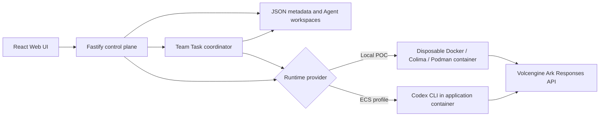

# Volc Agent Launchpad

A working multi-Agent coordination platform for middleware hackathons. It provides
Agent CRUD, a browser Playground, persistent workspaces, and a deterministic Team
Task coordinator backed by Codex CLI and the Volcengine Ark Responses API.

Run it locally with Docker, Colima, or rootless Podman, or deploy it to
Volcengine ECS.

> [!WARNING]
> This is a multi-user hackathon proof of concept, not a production identity
> system. Alice and Bob are local fixtures backed by hashed passwords and
> server sessions; use fictional data only. See [SECURITY.md](SECURITY.md).

## Track 1 submission: Bouncer

PotatoGuard is policy-governed multi-Agent middleware. It separates the human
operating the platform from every Agent principal, checks both Agent ownership
and protected-data authority on the server, and coordinates specialists through
a persistent Lead-controlled workflow. A protected file enters a disposable
Runtime only as an approved read-only mount. Denied files never enter it.

The submission includes:

- [One-page architecture and trust-boundary diagram](docs/POTATOGUARD_ARCHITECTURE.md)
- [Three-minute live demo script](docs/UNIFIED_DEMO.md)
- [Exact happy-path and edge-case judge runbook](docs/JUDGE_RUNBOOK.md)
- Automated authentication, ownership, authorization, revocation, and Runtime
  mount tests

## Features

- Username/password login with scrypt password hashes and HttpOnly sessions
- Per-user Agent ownership and a separate principal for every Agent
- Time-limited capability leases scoped to one Agent, action, and resource
- One-click Team Task consent that issues separate task-bound capabilities to
  the specialist roster and revokes them automatically when the team ends
- Protected-resource create, metadata/content replacement, and safe deletion
- Cross-user resource sharing: the owner grants another user read access to a
  chosen file (optional expiry, owner-only revoke); the grantee's Agents can then
  read it, and an un-shared file is denied immediately before the Runtime starts
- Backend policy enforcement before Agent execution
- Read-only protected-file mounts in disposable local Runtime containers
- Immediate revocation, automatic expiry, and deny-by-default behavior
- Hash-chained allow/deny receipts with human and Agent attribution and CSV
  export, plus an account-level "Sharing" view (share/revoke actions and reads
  on your files by other users' Agents)
- Browser-supplied human/owner IDs rejected at the HTTP boundary
- React and TypeScript Web UI
- Agent create, edit, start, stop, delete, and multi-turn chat
- Per-user Team Task history and controls; another signed-in user cannot inspect,
  stop, resume, or populate a task with foreign Agents
- Team Tasks with transcript-aware dynamic specialist routing, shared versioned state, and a shared workspace
- Live coordination progress, contextual handoffs, retry/failure evidence, stop/resume, and clean consecutive tasks
- Fastify control plane with asynchronous Run state
- Persistent Agent workspaces and Codex sessions
- Disposable Docker, Colima, or Podman container for each local turn
- Docker and Terraform deployment paths for Volcengine ECS

## Requirements

- Node.js 22+
- npm 10+
- Docker, Colima, or Podman
- A Volcengine Ark API key and endpoint that supports the Responses API

Codex CLI is included in the Runtime image and is not required on the host.

## Local browser SOP

### 1. Check the local tools

Install Node.js 22+ and one supported container engine, then verify them:

```bash
node --version
npm --version
docker --version        # Docker Desktop, Docker Engine, or Colima
podman --version        # Use this instead when running Podman
```

Only one container engine is required. Codex CLI is already included in the
Runtime image.

### 2. Clone the repository

```bash
git clone <repository-url> volc-agent-launchpad
cd volc-agent-launchpad
```

Skip this step when already working from the repository root.

### 3. Start the product

If `.env` already contains `ARK_API_KEY`, `ARK_MODEL`, and optionally
`ARK_BASE_URL`, run:

```bash
npm run poc
```

The startup script reads only those three Ark settings from `.env`; it ignores
Docker-only paths and other shell settings. You can also supply them explicitly:

```bash
cp .env.example .env
# Fill ARK_API_KEY and ARK_MODEL in .env, then run:
npm run poc
```

Values passed directly in the command environment override `.env`.

The first run installs Node.js dependencies and builds the Runtime image. The
script automatically selects Docker, Colima, or Podman.

### 4. Open the browser

Visit <http://localhost:3000>, or open it from the terminal:

```bash
open http://localhost:3000       # macOS
xdg-open http://localhost:3000   # Linux desktop
```

Sign in with one of the seeded, fictional demo accounts:

| User | Username | Password |
| --- | --- | --- |
| Alice Tan | `alice` | `alice-potato` |
| Bob Lim | `bob` | `bob-potato` |

These published credentials are controlled fixtures, not production accounts.

Signing in as **Alice** gives you seven ready, pre-seeded demo Agents (a Trip
Coordinator plus six specialists) so both demos work with no setup. To add your
own:

1. Select **Create agent**.
2. Enter a name, description, and workspace instructions.
3. Enter a task in the Playground, for example:

   ```text
   Create a TypeScript hello-world CLI, add a test, and run it.
   ```

The Agent can write files, run commands, and continue the same Codex session in
later messages.

### Team Tasks

Select **Team tasks** in the sidebar (the pre-seeded Agents are ready to use, or
create your own). Choose one Lead, one or more specialists, and describe a shared
objective. Optionally attach one of the signed-in user's protected documents.
The recommended **Authorize for this task** option records explicit consent,
issues a distinct read-only capability to each final specialist, restricts every
capability to this task ID, and revokes all of them at a terminal outcome. The
Lead receives only metadata and coordination context, never the raw document.

For a deliberate failure-and-recovery exercise, choose **Require manual
approval**. The first specialist without a valid manual lease is denied before a
Runtime starts, the task pauses, and it can be resumed after approval.

The selected specialists
form an authorized pool rather than a fixed sequence. After each contribution, the Lead
receives the updated actor-labelled transcript and dynamically selects the specialist
best suited to build on, refine, verify, or challenge the conversation. Specialists also
share one task workspace, with sequential turns so file writes remain deterministic.
Contributions, handoffs, active assignment, elapsed time, retries, shared-state patches,
and final Lead synthesis remain visible in one persistent chat transcript. After an
answer, the same reserved team, Codex threads, roster, and shared workspace stay ready
for the next message. Each message may select a different protected document. A running
request can be cancelled without ending the team; **End team** releases its Agents.

For a quick demo, pick **Trip Coordinator** as Lead with the three travel
specialists, and ask it to plan a short trip within a budget.

See the [coordination architecture](docs/COORDINATION_ARCHITECTURE.md) and
[judge runbook](docs/JUDGE_RUNBOOK.md) for the exact end-to-end flow.

### Cross-user file sharing

Every protected file belongs to one user. Another user's Agents cannot read it
until the **owner** shares it.

1. Sign in as **Bob**, open **Protected resources**, and press **Share** on
   *Partnerships Brief*. Pick Alice, enter a purpose, optionally set an expiry,
   and grant read access. (This share is also seeded on startup so the happy
   path works immediately.)
2. Sign in as **Alice**, open an Agent's **Playground**, pick *Partnerships
   Brief* in the protected-resource selector (`· shared with you`), and send a
   prompt. The file mounts read-only and the run proceeds.
3. Still as Alice, pick *Finance Report* instead — Bob never shared it. The run
   is refused immediately with `SHARE_MISSING`; nothing mounts and the Runtime
   never starts.
4. Back as Bob, **Revoke** the share (or let it expire). Alice's next run is
   denied with `SHARE_REVOKED`.

Every step is a hash-chained receipt. Alice sees her reads in each Agent's
**Audit receipts** tab; Bob sees the share, the revoke, and every read Alice's
Agents made on his files in the account-level **Sharing** tab (with CSV export).

Limitations: sharing is read-only, only the owner can share (no re-sharing by
the grantee), and a share applies to all of the grantee's Agents.

### 5. Stop and resume

Press `Ctrl+C` in the startup terminal. The script removes temporary Runtime
containers but keeps Agent workspaces and conversations.

- macOS state: `~/.volc-agent-launchpad/`
- Linux state: `.local/`
- Custom location: set `LOCAL_POC_DATA_ROOT`

Run the same `npm run poc` command to continue later.

### Select a specific container engine

Force Podman when multiple engines are installed:

```bash
CONTAINER_ENGINE=podman \
ARK_API_KEY=your-ark-api-key \
ARK_MODEL=ep-your-endpoint-id \
npm run poc
```

Colima uses `CONTAINER_ENGINE=docker` because it exposes the Docker CLI.

For a clean Linux host, follow the
[rootless Podman setup](docs/LOCAL_POC.md#rootless-podman-on-linux).

## Docker Compose

Create and edit the configuration:

```bash
./scripts/bootstrap-local.sh
```

Required values in `.env`:

```dotenv
ARK_API_KEY=your-ark-api-key
ARK_MODEL=ep-your-endpoint-id
APP_AUTH_TOKEN=replace-with-at-least-24-random-characters
```

Start the application:

```bash
docker compose up --build
```

Open <http://localhost:3000>. Stop it without deleting Agent data:

```bash
docker compose down
```

## Development

```bash
npm install
cp .env.example .env
npm install --global @openai/codex@0.111.0
npm run dev
```

- Web UI: <http://localhost:5173>
- API: <http://localhost:3000>

Use local paths in `.env` when running outside Docker:

```dotenv
APP_DATA_DIR=.data
AGENT_WORKSPACE_ROOT=workspaces
CODEX_HOME=codex-home
```

## Deployment

- [Existing Linux ECS with Docker](docs/DEPLOYMENT.md#existing-linux-ecs)
- [Complete Volcengine environment with Terraform](docs/DEPLOYMENT.md#terraform-deployment)
- [Local Docker, Colima, and Podman details](docs/LOCAL_POC.md)

The existing-ECS script deploys from the current source tree:

```bash
cp .env.example .env.production
./scripts/deploy-existing-ecs.sh .env.production
```

The Terraform path provisions VPC, subnet, security group, ECS, and EIP:

```bash
cp deploy/volcengine/terraform.tfvars.example \
  deploy/volcengine/terraform.tfvars
./scripts/deploy-volcengine.sh
```

## Configuration

| Variable | Default | Purpose |
| --- | --- | --- |
| `ARK_API_KEY` | Required | Ark model API key. |
| `ARK_MODEL` | Required | Responses-capable endpoint or model ID. |
| `ARK_BASE_URL` | Beijing v3 endpoint | Ark OpenAI-compatible API URL. |
| `APP_AUTH_TOKEN` | Empty on loopback | Shared demo token; use 24+ random characters remotely. |
| `RUNTIME_PROVIDER` | `local-process` | `container` for disposable local Runtime containers. |
| `CODEX_SANDBOX_MODE` | `workspace-write` | Codex inner sandbox mode. |
| `CODEX_TIMEOUT_MS` | `600000` | Maximum duration of one turn. |
| `LOCAL_POC_DATA_ROOT` | Platform-specific | Local metadata, workspace, and session directory. |

See [.env.example](.env.example) for all Runtime and resource-limit options.

## How it works



The first turn uses `codex exec`; later turns resume the stored Codex thread.
Deleting an Agent archives its workspace under `workspaces/.deleted/`.

See [docs/ARCHITECTURE.md](docs/ARCHITECTURE.md) for component and extension
boundaries.

## Validation

```bash
npm run check
terraform fmt -check -recursive deploy/volcengine
docker compose config
```

The automated suite includes authentication, foreign-Agent and foreign-task
isolation, cross-user resource denial, missing/revoked/expired grants,
task-capability non-reuse, terminal revocation, read-only Runtime mounts,
coordinator recovery, and hash-chain tamper detection.

## Judging evidence

The current event rules score four criteria equally. This repository maps them
to visible and testable evidence rather than slide-only claims:

| Criterion | Submission evidence |
| --- | --- |
| Technical execution | Server-resolved sessions, per-Agent principals, task-bound capabilities, pre-Runtime policy checks, read-only container mounts, persistent coordination state, structured Lead decisions, retries, and two verified receipt chains |
| Innovation and problem insight | Treats delegation authority and data authority as independent; human ownership does not silently become standing Agent privilege |
| Feasibility and practicality | One-click task consent solves lease fatigue; manual approval remains for high-risk workflows; Docker SOP, health checks, migrations, CSV evidence, and automated tests make the demo reproducible |
| Impact and relevance | Enables useful multi-Agent work over private context while preserving tenant isolation, least privilege, attribution, revocation, and failure recovery |

See the [official rules](https://tiktoktechjam2026.devpost.com/rules) for the
authoritative wording and [UNIFIED_DEMO.md](docs/UNIFIED_DEMO.md) for the exact
three-minute proof.

## Honest limitations

- Local seeded users and a single-process JSON store replace production OIDC and
  a transactional policy database.
- Hash chains make mutation detectable but are not signed or written to an
  external append-only/WORM audit system.
- Protected actions are intentionally read-only; there is no write-capability
  workflow in this submission.
- The coordinator serializes turns within a task and permits one open task per
  user. Production would add a durable queue and per-workspace locks.
- Task capabilities expire after 30 minutes as a crash-safe upper bound and are
  also revoked when the persistent team is explicitly ended.
- Local Runtime containers share the host Codex configuration/session store so
  existing conversations can resume. Protected vault files are never stored
  there, but production must isolate Codex state per Agent principal.

## Documentation

- [Architecture](docs/ARCHITECTURE.md)
- [Multi-Agent coordination architecture](docs/COORDINATION_ARCHITECTURE.md)
- [Three-minute demo script](docs/UNIFIED_DEMO.md)
- [Local POC](docs/LOCAL_POC.md)
- [Deployment](docs/DEPLOYMENT.md)
- [Hackathon extension guide](docs/HACKATHON_EXTENSION_GUIDE.md)
- [Judge runbook](docs/JUDGE_RUNBOOK.md)
- [Security policy](SECURITY.md)
- [Contributing](CONTRIBUTING.md)

## License

[MIT](LICENSE)
