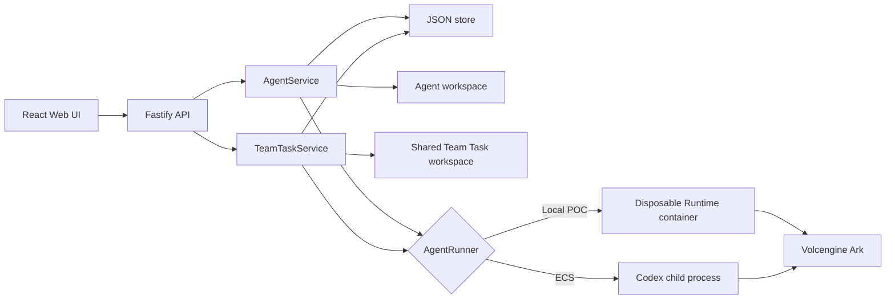

# Architecture

Volc Agent Launchpad is a single-node control plane for hackathon use.



## Components

### Web UI

Lists Agents, manages lifecycle actions, submits prompts, and polls asynchronous
Runs. It never receives the Ark API key.

### Fastify API

Validates requests, protects remote demos with a shared bearer token, and
serves the compiled Web UI. The token is not user identity or authorization.

### AgentService

Coordinates lifecycle state, persistence, workspaces, and Runs. One Agent can
have only one active Run.

```text
ready -> busy -> ready
  |       |
  v       v
stopped  error
```

Interrupted Runs become `cancelled` after a restart.

### TeamTaskService

Coordinates one shared objective at a time using existing Agents. A selected Lead
delegates one context-aware assignment through a validated JSON decision. After each
specialist result, control returns to the Lead with an actor-labelled transcript. The
Lead explicitly selects the next relevant Agent from the authorized specialist pool
instead of following list order or a fixed rotation. Specialists work sequentially in
one shared task workspace so file changes remain deterministic. The service owns Agent
reservations, ordered events, shared state, retry handling, participation enforcement,
a 12-specialist-round collaboration limit, and the 30-turn global safety limit. Direct
conversational assignments return literal results, while workspace artifacts and
execution are reserved for objectives that explicitly request them.

An Agent's Team Task threads and workspace are separate from its personal
Playground thread and workspace. Active tasks pause after a server restart and can
be resumed explicitly through the Lead.

### Storage

```text
data/launchpad.json       Agent, message, and Run metadata
workspaces/AgentID/       Agent-created files
workspaces/.team-tasks/   Shared Team Task files
workspaces/.deleted/      Archived deleted workspaces
codex-home/               Codex configuration and sessions
```

`JsonStore` serializes writes and atomically replaces one JSON file. It supports
one process only.

### Runtime providers

- `CodexRunner` runs Codex inside the application container for ECS.
- `ContainerCodexRunner` starts one disposable Docker, Colima, or Podman
  container for every local turn.

Both providers use argv-only process execution, bound output and time, resume
the stored Codex thread, and escalate termination after a grace period.

## Deployment profiles

| Profile | Control plane | Agent execution |
| --- | --- | --- |
| Local POC | Host Node.js | Disposable local container |
| ECS | Application container | Codex process in the same container |
| Local development | Host Node.js | Host Codex process |

## Extension seams

| Track | Primary seam | Expected change |
| --- | --- | --- |
| Glass Box | `AgentRunner`, `AgentRun` | Emit and display correlated execution events. |
| Bouncer | API routes, Agent ownership | Add identity and server-side authorization. |
| Kill Switch | `AgentRunner` | Add threat-specific policy or a stronger sandbox. |

The current container or ECS instance is the POC trust boundary. Ordinary
containers are not hardened multi-tenant isolation.
