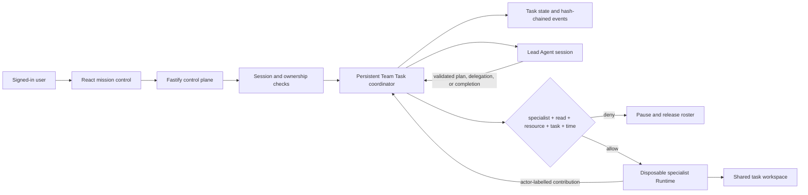

# Multi-Agent Coordination Architecture

## Objective

Team Tasks are persistent middleware, not scripted UI choreography. The signed-in
user supplies an objective, Lead, specialist-selection policy, and optionally an
owned protected document. The server reserves only that user's Agents, validates
every Lead decision, gates every protected specialist turn, persists every
transition, and releases the roster at a terminal outcome.

## Protected task flow

1. The API derives the human owner from the session; browser-supplied owner IDs
   are rejected.
2. The coordinator accepts only owned, ready Agents and an owned resource.
3. In recommended task-access mode, the server issues one read capability per
   final specialist. It is bound to the task ID and has a 30-minute crash-safe
   upper bound.
4. The Lead receives the objective, roster metadata, shared state, and labelled
   transcript. It never receives the protected mount.
5. A Lead decision must validate against the committed roster. Out-of-pool IDs
   are rejected.
6. Before each specialist turn, authorization is evaluated again. An allow
   produces a read-only mount for that disposable turn; a deny pauses the task
   before the Runtime is invoked.
7. The contribution returns to the Lead, which chooses the next specialist or
   synthesizes the final result.
8. Completion, failure, or stop releases Agents and revokes all task capabilities.

## Coordination guarantees

- Task listing, detail, event verification, stop, and resume are owner-scoped.
- A user cannot put another user's Agent or resource into a task.
- One open task per user prevents conflicting workflows without allowing one
  tenant to block another.
- The first Lead turn commits `facilitated` or `sequential` routing; the server
  owns all later transitions.
- Specialist work is sequential within the shared workspace, avoiding concurrent
  file-write races.
- Lead failures retry once then pause. Specialist failures retry once then return
  to the Lead for a recovery decision.
- Twelve successful specialist rounds force synthesis; 30 total turns are the
  global runaway guard.
- Every start, plan, handoff, policy decision, contribution, retry, state patch,
  pause, resume, stop, and completion enters an ordered hash chain.
- Restarted in-flight tasks become paused and require explicit human resume.

## Deliberate scope

The coordinator and JSON store run in one process. Production requires a
transactional database, durable queue, distributed leases, per-workspace locks,
and hardened tenant Runtime isolation. The POC's value is the executable policy
and state-machine boundary, not a claim of production infrastructure.
