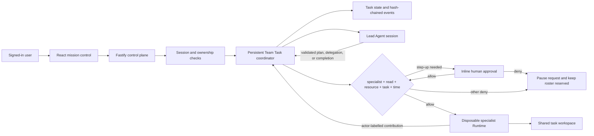
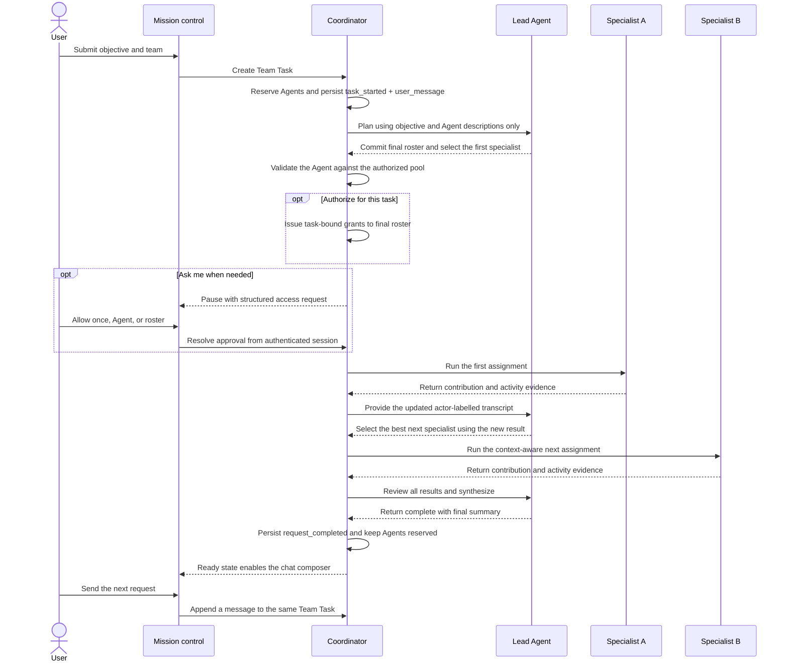

# Multi-Agent Coordination Architecture

## Objective

Team Tasks are real middleware, not a scripted UI. A user creates a persistent team
conversation with a Lead plus one or more specialists, then sends it successive requests.
The server owns the workflow state,
reserves the participating Agents, invokes each Codex Runtime turn, validates its
structured result, and persists every transition. The roster remains reserved between
answers and is released only when the user ends the team.

## Protected task flow

The Lead is intentionally consulted after every specialist turn. This prevents later
work from being selected before earlier output exists. The UI polls quickly and shows
the active routing or specialist assignment, elapsed time, and conversation round so
the genuine collaboration remains understandable while it runs.

## Coordination guarantees

- The server, not the browser, chooses the active Agent and owns all transitions.
- A Lead-selected roster is finalized before protected capabilities are issued;
  the Lead never receives a protected mount.
- Step-up approval is created by middleware, persisted across reloads, and
  resolved by the authenticated human before the blocked specialist continues.
- Only selected, ready Agents can participate; they are reserved for the task.
- Every delegation explicitly names one selected specialist; out-of-pool IDs fail validation.
- At least two distinct specialists contribute when the authorized pool contains two or more.
- The Lead may reuse a specialist or leave an irrelevant pool member unused when the transcript justifies it.
- Every specialist receives the same objective, shared state, assignments, named prior messages, and activity evidence.
- Shared-workspace turns are sequential to avoid conflicting file writes.
- Every turn start, decision, handoff, result, retry, failure, pause, resume, stop,
  state patch, and completion is recorded as an ordered event.
- Each Agent has a separate per-task Codex thread while sharing task context and the
  task workspace.
- A Lead failure pauses the task after two attempts. A specialist failure returns to
  the Lead after two attempts for a dynamic recovery decision.
- Twelve successful specialist rounds force final synthesis; a 30-turn global limit
  is the second runaway-coordination safeguard.
- Restarted in-flight tasks become paused and can be resumed explicitly.
- Completed requests return the persistent team to ready without clearing its roster,
  threads, workspace, or transcript. Ending the team clears Agent reservations.

## Deliberate scope

The final hackathon build permits one ready, active, or paused Team conversation
per signed-in user. This keeps each workspace deterministic while preserving tenant
isolation. The next production step would be a durable queue with per-workspace locks
and a database transaction layer for concurrent teams.
