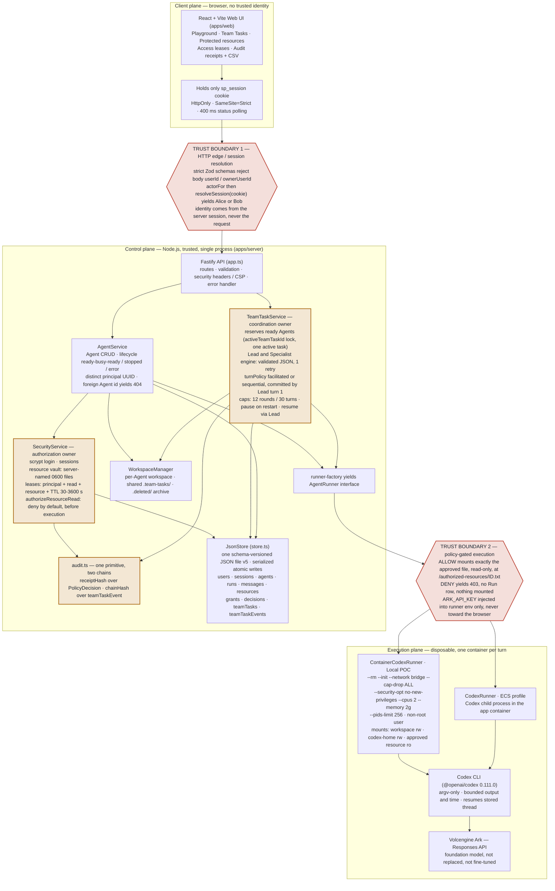
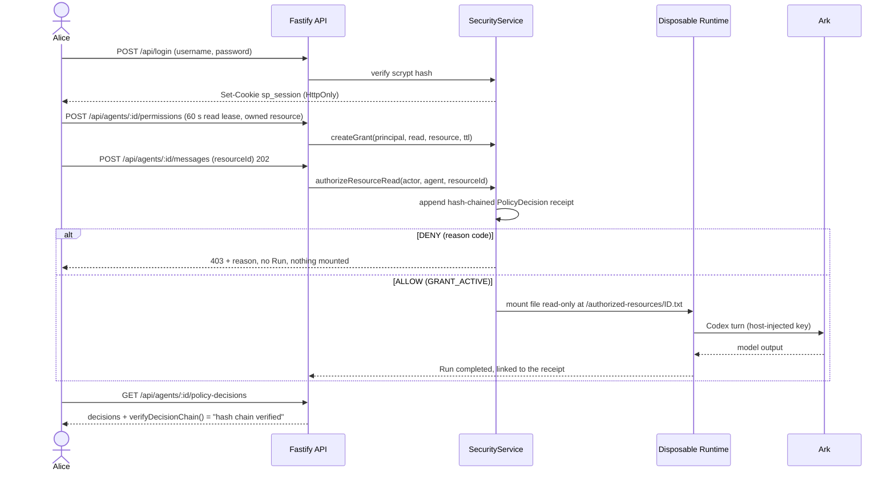
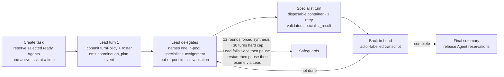

# Final architecture — Agent Launchpad + PotatoGuard

One-page architecture for the whole repository.

- **Authorization boundary** (`SecurityService`) — decides, *before* any
  execution, whether an Agent may read a protected resource.
- **Coordination boundary** (`TeamTaskService`) — owns multi-Agent turn-taking so
  the browser never chooses the acting Agent.

Every allow, deny, hand-off, and completion is an ordered, hash-chained record.

## System architecture and trust boundaries

Three planes follow one request, top to bottom. The two hexagons are the trust
boundaries this project enforces. Highlighted nodes (`new`) are code this project
added; plain nodes are the untouched Starter Kit.

## Main components

| Component | File | Role | Owner |
| --- | --- | --- | --- |
| Web UI | `apps/web` | One screen per capability; never receives the model key or protected content | Starter Kit |
| Fastify API | `apps/server/src/app.ts` | REST routes, Zod validation, CSP / security headers, serves the built UI in production | Starter Kit |
| AgentService | `agent-service.ts` | Agent CRUD, lifecycle FSM, single-Agent Runs, per-Agent principal, ownership checks | Starter Kit + principal |
| SecurityService | `security-service.ts` | scrypt login, sessions, resource vault, capability leases, `authorizeResourceRead()`, receipts | **This project** |
| TeamTaskService | `team-task-service.ts` | Agent reservation, Lead/Specialist turn engine, ordered coordination events, safeguards | **This project** |
| audit | `audit.ts` | `receiptHash` (authorization) + `chainHash` (coordination) hash-chain primitive | **This project** |
| JsonStore | `store.ts` | One schema-versioned JSON file, serialized atomic writes, migrations | Starter Kit + schema |
| WorkspaceManager | `workspace.ts` | Per-Agent workspaces, shared Team Task workspace, deleted-workspace archive | Starter Kit |
| AgentRunner | `container-codex-runner.ts` / `codex-runner.ts` | Disposable container per turn (Local POC) or child process (ECS) | Starter Kit |
| Ark | external | Foundation model via the Responses API | External |

## Data and decision flow — protected read (Bouncer demo)

### Authorization ladder — deny by default

`SecurityService.authorizeResourceRead()` checks in this order and records a
receipt on every path:

| Condition | Reason | Outcome |
| --- | --- | --- |
| Agent not owned by the caller | `AGENT_NOT_OWNED` | deny |
| Resource missing or deleted | `RESOURCE_NOT_FOUND` | deny |
| Resource owned by another user and not shared | `SHARE_MISSING` | deny |
| Unexpired, unrevoked `read` lease for this principal | `GRANT_ACTIVE` | **allow** |
| Lease was revoked | `GRANT_REVOKED` | deny |
| Lease has expired | `GRANT_EXPIRED` | deny |
| No matching lease | `GRANT_MISSING` | deny |

`ALLOW` → mount the file read-only, create the Run, link Run ↔ receipt.
Any `DENY` → `403`, receipt still appended, no Run, no mount.

## Coordination turn loop (Team Tasks)

Every turn start, decision, hand-off, result, retry, failure, pause, resume, and
completion is an ordered event, hash-chained with the same primitive and verified
by `verifyEventChain()` (surfaced as `eventsVerified` on the task detail route).

## Trust boundaries and controls

| Boundary | Trusted source | Enforcement |
| --- | --- | --- |
| Browser → control plane | Hashed server session identifies the human | Strict schemas reject supplied `userId` / `ownerUserId`; `HttpOnly`, `SameSite=Strict` cookie; optional bearer token for remote demos |
| Human → Agent | Stored Agent row identifies owner and principal | Foreign Agents return `404`; every Agent gets a UUID principal |
| Agent → protected resource | Stored lease and server time | Deny by default; exact principal, `read`, resource, expiry, and revocation checks, decided before execution |
| Control plane → Runtime | Successful policy decision | Only the approved server path is mounted, read-only, into the disposable container; the model key never crosses back toward the browser |
| Browser → acting Agent (coordination) | Server-held task state | `TeamTaskService` reserves Agents and chooses every turn; the browser only submits the objective and polls |
| Decision / event → evidence | Server-created immutable snapshot | Each record carries the previous record's hash; verification detects any edit |

## One evidence trail, two chains

| Chain | Primitive | Covers | Verified by |
| --- | --- | --- | --- |
| Authorization receipts | `receiptHash(decision, prevHash)` | human, Agent principal, action, resource, outcome, reason | `verifyDecisionChain()` + CSV export in the Audit view |
| Coordination events | `chainHash(payload, prevHash)` | every `teamTaskEvent` transition | `verifyEventChain()` + `eventsVerified` on the task route |

Editing any stored row breaks its chain from that point on. A receipt-tamper test
is part of the server test suite (`npm run check`, 50 tests).

## Deployment profiles

| Profile | Control plane | Agent execution | Command |
| --- | --- | --- | --- |
| Local POC (judging path) | Host Node.js | Disposable Docker / Colima / Podman container per turn | `npm run poc` → `localhost:3000` |
| Docker Compose | Application container | Codex process in the same container | `docker compose up --build` |
| Volcengine ECS | Application container on ECS | Codex process in the same container | Terraform: VPC · subnet · security group · ECS · EIP |

## Honest boundary

Seeded demo identities (`alice` / `bob`), a single-process JSON store, and
ordinary local containers — not hardened multi-tenant isolation. Hash chaining
detects edits but is not an external append-only log.

**Next production step:** OIDC / SSO, transactional policy storage, a signed /
WORM audit sink, HTTPS + Secure cookies, per-tenant Runtime isolation, and a
durable queue with per-workspace locks for concurrent teams.

## Related documents

- [ARCHITECTURE.md](ARCHITECTURE.md) — component and extension boundaries
- [POTATOGUARD_ARCHITECTURE.md](POTATOGUARD_ARCHITECTURE.md) — authorization boundary detail
- [COORDINATION_ARCHITECTURE.md](COORDINATION_ARCHITECTURE.md) — multi-Agent coordination detail
- [JUDGE_RUNBOOK.md](JUDGE_RUNBOOK.md) — start-to-finish validation flow
