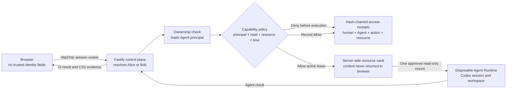

# PotatoGuard one-page architecture

## Objective

PotatoGuard proves that a human may own an Agent without giving that Agent all
of the human's access. Every Agent has a distinct non-human principal and zero
standing protected-resource privilege. A scoped capability lease must pass a
server policy immediately before a protected file enters the Runtime.

## Trust boundaries and controls

| Boundary | Trusted source | Enforcement |
| --- | --- | --- |
| Browser → control plane | Hashed server session identifies the human | Strict request schemas reject supplied `userId`/`ownerUserId`; HttpOnly, SameSite cookie |
| Human → Agent | Stored Agent row identifies owner and principal | Foreign Agents return not found; every Agent gets a UUID principal |
| Agent → protected resource | Stored lease and server time | Deny by default; exact principal, `read`, resource, expiry, and revocation checks |
| Vault → Runtime | Successful policy decision | Only the approved server path is mounted, read-only, into the disposable container |
| Decision → evidence | Server-created immutable attribution snapshot | Each receipt includes the previous receipt hash; verification detects modification |

## State-changing controls

- Owners create protected text resources and may replace content without the
  old content ever returning to the browser.
- Leases last 30–3,600 seconds and can be revoked immediately.
- Deleting a user-created resource soft-deletes its metadata, removes its file,
  and revokes every active lease to it.
- Allowed and denied reads produce receipts; a successful Run is correlated
  back to its policy decision.

## Denied path

Missing, expired, or revoked lease; foreign Agent; foreign resource; or deleted
resource → append denial receipt → do not create a Run → do not mount the file.

## Honest boundary

This hackathon build uses seeded demo identities, a single-process JSON store,
and ordinary local containers. Hash chaining detects receipt modification but
is not an external append-only log. Production next steps are OIDC/SSO,
transactional policy storage, a signed/WORM audit sink, HTTPS/Secure cookies,
and hardened per-tenant sandboxes.
