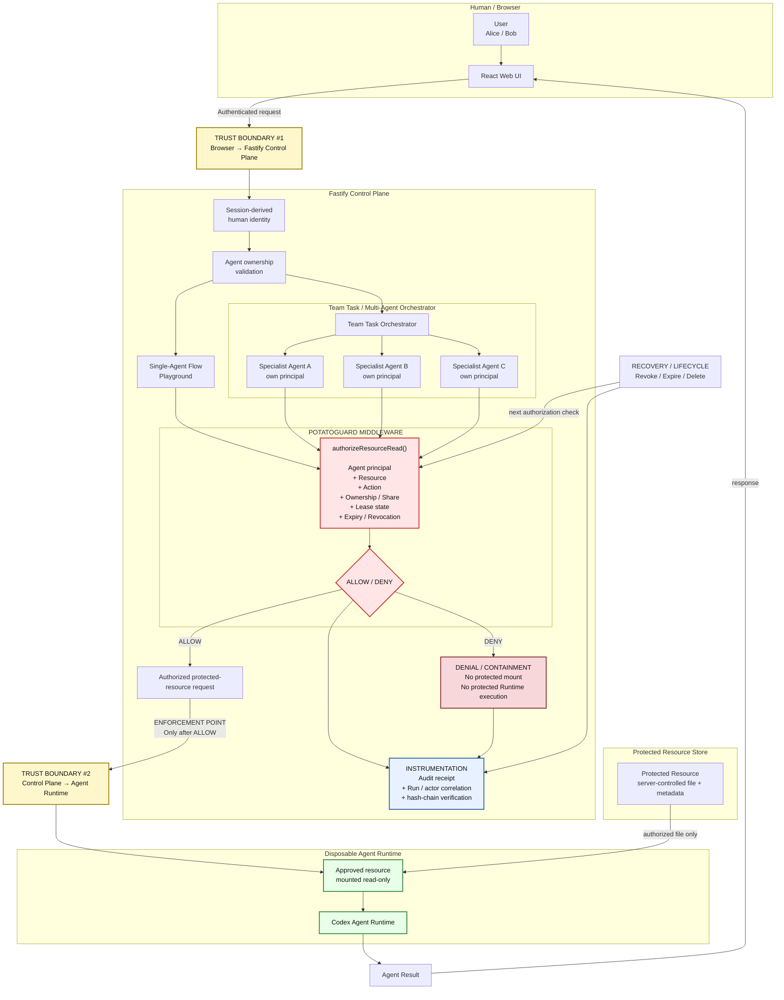

# PotatoGuard Architecture

> **Design goal:** PotatoGuard is placed at the pre-Runtime boundary because browser controls and model behavior are not trusted to enforce protected-resource authorization.



## Trust Boundaries

- **Boundary #1 — Browser → Control Plane:** the browser supplies user intent, but PotatoGuard derives the human actor from the authenticated server session. Client-controlled ownership fields are not trusted.
- **Boundary #2 — Control Plane → Agent Runtime:** protected data may cross this boundary **only after PotatoGuard returns `ALLOW`**.

## Enforcement Point

`authorizeResourceRead()` is the focused server-side authorization boundary for protected-resource execution in this POC.

Both execution modes converge on the same middleware contract:

```text
Single Agent ──────────────┐
                           ├─> PotatoGuard ─> ALLOW / DENY
Team Task Specialist ──────┘
```

Each specialist Agent is authorized independently using its own principal and scoped authority.

## Instrumentation and Recovery

- **Instrumentation:** every authorization outcome is recorded as audit evidence with actor, Agent, resource, decision, reason, and correlation metadata.
- **Denial / containment:** `DENY` stops the protected request before the protected resource is mounted into the Runtime.
- **Recovery / lifecycle:** revocation, expiry, and deletion are enforced on subsequent authorization checks and recorded in the audit trail.

## Extensible Contract

PotatoGuard's authorization boundary is intentionally narrow:

```text
Input:
  Agent + Resource + Action + Context

Output:
  ALLOW | DENY
```

The same boundary can be extended with additional policy context—such as write/deploy actions, budgets, environments, or risk levels—without changing the Agent Runtime or UI architecture.
