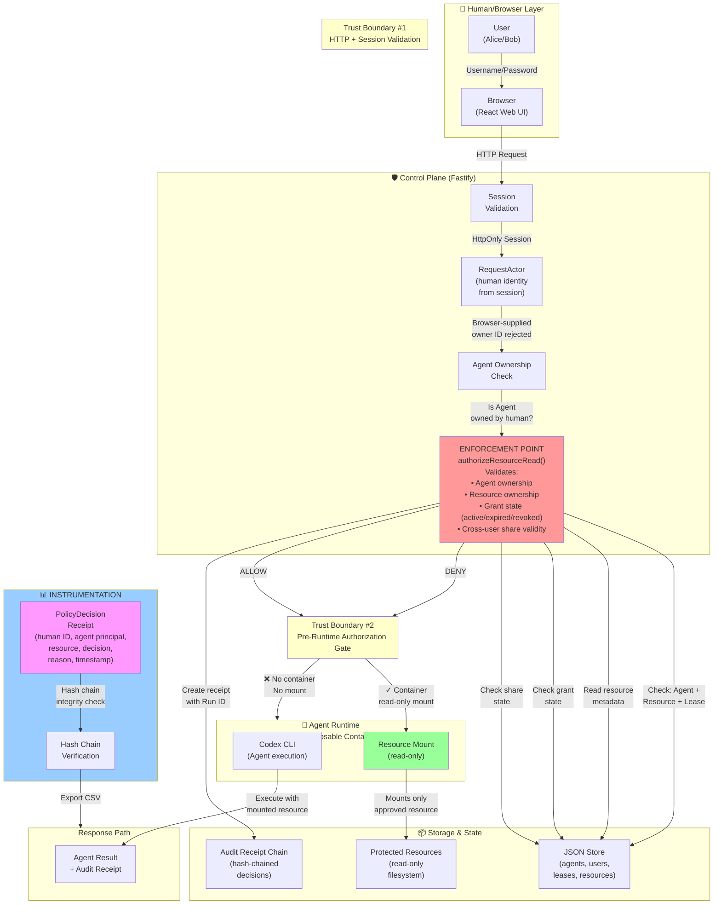

# PotatoGuard Architecture

PotatoGuard is an authorization middleware layer that sits at the boundary between the control plane and the Agent Runtime. This document describes the trust boundaries, enforcement points, and instrumentation paths.

## Architecture Diagram



## Trust Boundaries

### **Boundary #1: HTTP Request Entry**

**Location:** Between browser and Fastify server (`apps/server/src/app.ts`)

**What crosses:** Unauthenticated HTTP requests with optional session cookies

**Trust rules:**
- Server always validates the HttpOnly session cookie; browser-supplied `ownerUserId`, `agentId`, or `principalId` are ignored
- Session must be valid and non-expired
- `RequestActor` is derived from session, never from request body or URL parameters
- Invalid or missing session → 401 Unauthorized

**Why it matters:** Prevents a malicious browser from claiming to be a different human or Agent

---

### **Boundary #2: Pre-Runtime Authorization Gate**

**Location:** Between control plane and disposable Runtime container (`apps/server/src/app.ts`, `security-service.ts`)

**What crosses:** Authorized requests only; protected resources as read-only mounts

**Trust rules:**
- `authorizeResourceRead(actor, agent, resourceId)` is called before `runner.start()`
- If DENY: no container is created, no mount occurs, error is returned immediately
- If ALLOW: container is created with the approved resource mounted read-only
- Decision is recorded with Run ID for audit correlation

**Why it matters:** Ensures protected data never enters the Runtime on an authorization denial. The decision is final and binding before any Agent execution.

---

### **Boundary #3: Runtime Isolation**

**Location:** Between container and host filesystem (`apps/server/src/container-codex-runner.ts`)

**What crosses:** Input prompts, read-only resource mounts, Agent output

**Trust rules:**
- Container runs Codex in a sandboxed process
- Mounted resources are read-only; Agent cannot modify or exfiltrate them
- Agent output is captured and returned to control plane
- Container is cleaned up after the run completes or times out

**Why it matters:** Even if authorization is bypassed, the container boundary prevents Agent from accessing host secrets or other Agents' workspaces.

---

## Enforcement Point

The **ENFORCEMENT POINT** is the `authorizeResourceRead()` function in `security-service.ts`.

It is the **single place** an authorization decision is made for resource access. All resource-based runs (single-Agent Playground and Team Task specialists) call this function before Runtime execution.

**Decision logic:**

```
authorizeResourceRead(actor, agent, resourceId):
  1. Resolve human identity from session (RequestActor) ✓
  2. Load Agent: is agent.ownerUserId == actor.userId? → no: DENY
  3. Load resource: does it exist? → no: DENY
  4. If agent.ownerUserId == resource.ownerUserId:
       → Agent is using its own resource; check for active lease (grant)
       → Lease exists and active? → ALLOW
       → Otherwise: DENY (GRANT_EXPIRED, GRANT_REVOKED, or no grant)
  5. If agent.ownerUserId != resource.ownerUserId:
       → Cross-user access; check for active share from owner
       → Share exists, active, and not expired? → ALLOW
       → Otherwise: DENY (SHARE_MISSING, SHARE_REVOKED, SHARE_EXPIRED)
  6. Record PolicyDecision (ALLOW/DENY) with human ID, Agent principal, reason
  7. Return decision; control plane acts immediately
```

**Guarantee:** There is no code path that bypasses this function, modifies a decision after it is made, or allows an authorization bypass at the UI layer.

---

## Instrumentation / Audit Trail

Every authorization decision and resource-management action is recorded in the **PolicyDecision** audit trail.

**PolicyDecision structure:**
- `id`: UUID
- `humanUserId`: human identity (from session)
- `humanName`: human display name
- `agentId`: Agent UUID (or null for management actions)
- `agentName`: Agent display name
- `agentPrincipalId`: Agent's independent cryptographic principal
- `action`: "read" | "create" | "delete" | "share" | "unshare"
- `resourceId`: protected resource ID
- `resourceName`: resource name
- `resourceOwnerUserId`: denormalized owner
- `outcome`: "allow" | "deny"
- `reason`: specific denial reason (e.g., "GRANT_EXPIRED", "SHARE_MISSING", "RESOURCE_NOT_OWNED")
- `grantId`: lease UUID (if applicable)
- `teamTaskId`: Team Task UUID (if specialist turn)
- `receiptHash`: SHA-256 of the previous decision (hash chain)
- `timestamp`: ISO 8601

**Hash-chain integrity:**

```
Decision N includes receiptHash = SHA-256(Decision N-1)
Modified Decision N-1 → receiptHash mismatch in Decision N
Tampered receipts invalidate the chain
```

**Verification path:**

```
verifyReceiptChain(decisions) in audit.ts:
  for each decision:
    compute expected receiptHash from previous decision
    if actual != expected: return false (chain is broken)
  return true (chain is intact)
```

**Export path:**

```
GET /api/account/receipts.csv → CSV with all decisions:
  - human-id, human-name, agent-id, agent-name, agent-principal, 
    action, resource-id, resource-name, outcome, reason, timestamp
  - suitable for compliance audit and forensics
```

---

## Denial / Containment

When authorization is **denied:**

1. `authorizeResourceRead()` returns DENY with a specific reason (e.g., `SHARE_MISSING`)
2. Control plane **does not** call `runner.start()`
3. **No container is created**
4. **No protected resource is mounted**
5. **Agent does not run**
6. Error response is returned to the browser (e.g., `{ code: "RESOURCE_ACCESS_DENIED", reason: "SHARE_MISSING", resourceId: "doc-123" }`)
7. Denial receipt is recorded immediately, correlating the human ID, Agent principal, and reason
8. Browser displays the denial and may offer an approval workflow (for manual access mode in Team Tasks)

**Guarantee:** A denied authorization results in zero Agent execution and zero protected data exposure.

---

## Revocation and Expiry

When a resource is **deleted** or a **lease is revoked:**

1. **Immediate invalidation:** Grant or share record is updated with `revokedAt` timestamp
2. **Next-turn denial:** On the Agent's next authorization check, `grantState(grant)` returns "revoked" or "expired"
3. **No grace period:** The denial is immediate; old Agents cannot reuse expired leases
4. **Cascading cleanup:** Resource deletion cascades to all dependent grants and shares; revocation receipts are created for each

**Example revocation flow:**

```
1. Alice grants a read lease to Agent X for 15 minutes
2. Agent X's first run with the resource: ALLOW, lease active
3. Alice revokes the lease (or 15 minutes pass)
4. Agent X's next run with the same resource: DENY, lease state is "revoked"/"expired"
5. Revocation receipt is created; Alice sees it in her account audit view
```

---

## Recovery

**Failed authorizations are paused, not silent:**

- In a Team Task with manual access mode, a denied run pauses the orchestration and prompts the human for approval
- The human sees the specific denial reason (e.g., "Agent X does not have read access to Finance Report")
- The human can approve the request for one turn, one Agent, or the entire roster
- The specialist run resumes with the new grant
- Every approval and denial is recorded in the orchestration transcript and audit trail

---

## Summary

| Component | Role | Assurance |
|---|---|---|
| **Session validation** | Derive RequestActor from server-side state | Browser cannot forge identity |
| **Agent ownership check** | Is the Agent owned by the human? | Foreign Agents return 404 |
| **Resource ownership check** | Does the Agent own the resource or hold a valid cross-user share? | No unauthorized access |
| **Lease/grant validation** | Is the lease active (not expired or revoked)? | Revocation is immediate |
| **Pre-runtime enforcement** | Decision is made before Runtime starts | No protected data reaches Agent on DENY |
| **Audit receipt chain** | Decisions are hash-chained and tamper-evident | Integrity is verifiable, chain breaks on tampering |
| **Read-only mounts** | Protected resource is mounted read-only | Agent cannot modify or exfiltrate |
| **Container cleanup** | Each run's container is disposable and deleted | No state leakage between runs |

