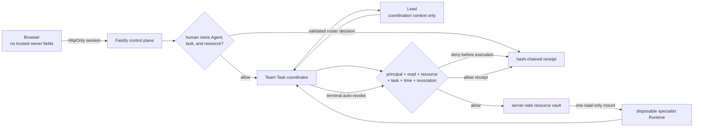

# PotatoGuard one-page architecture

## Objective

Human ownership, Agent data authority, and Lead delegation are separate. Every
Agent has a distinct principal and no standing protected-resource privilege. A
manual or task-bound capability must pass server policy immediately before a
protected file enters a Runtime.

## Trust boundaries and controls

| Boundary | Trusted source | Enforcement |
| --- | --- | --- |
| Browser → control plane | Hashed server session | Strict schemas reject `userId` and `ownerUserId`; HttpOnly, SameSite cookie; Secure in production mode |
| Human → Agent/task | Stored owner IDs | Foreign Agents and Team Tasks return 404; lists are owner-filtered |
| Human → resource | Stored resource owner | External metadata is minimized; foreign grants and task attachment are denied |
| Agent → resource | Stored capability and server time | Exact principal, `read`, resource, task context, expiry, and revocation checks; deny by default |
| Vault → Runtime | Successful policy decision | Only one approved server path is mounted read-only for that turn |
| Decision → evidence | Server attribution snapshot | Each receipt includes the previous receipt hash; mutation breaks verification |

## Capability modes

- **Manual:** one Agent + one resource + read + purpose + expiry. Useful for the
  Playground and high-risk approval/recovery demos.
- **Team Task:** explicit attach-time consent creates separate specialist grants,
  each additionally bound to one task ID. They cannot authorize Playground or a
  different task and are revoked on completion, failure, or stop.

The Lead never gets a protected mount. Delegation therefore cannot widen data
authority. Every specialist is checked on every protected turn.

## Denied path

Missing, expired, revoked, wrong-task, foreign-Agent, foreign-resource, or deleted
resource → append denial receipt → do not create a Run → do not mount the file.

## Honest boundary

This POC uses seeded identities, a single-process JSON store, and local
containers. Hash chaining detects modification but is neither signed nor an
external append-only log. Existing conversation resumption also uses one shared
host Codex state directory; protected vault files are not stored there, but
production must partition that state by Agent principal. Other next steps are
OIDC/SSO, transactional policy storage, signed WORM receipts, durable
coordination, and hardened per-tenant sandboxes.
